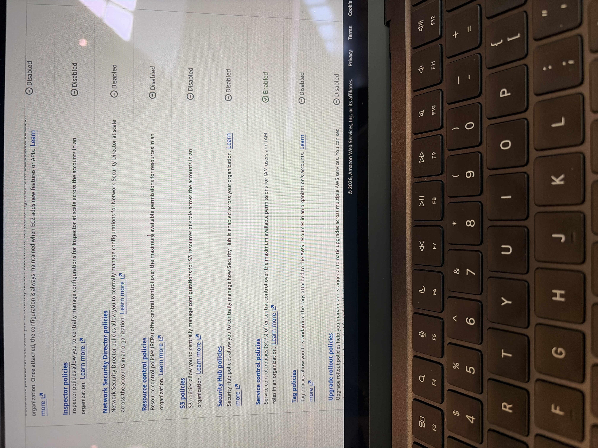
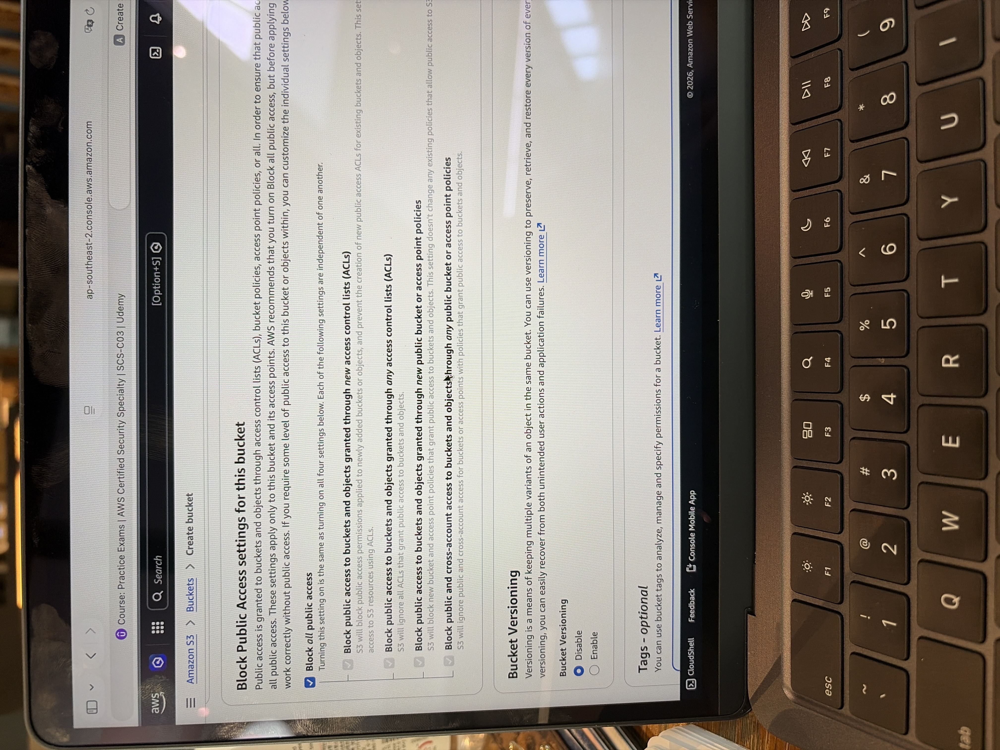
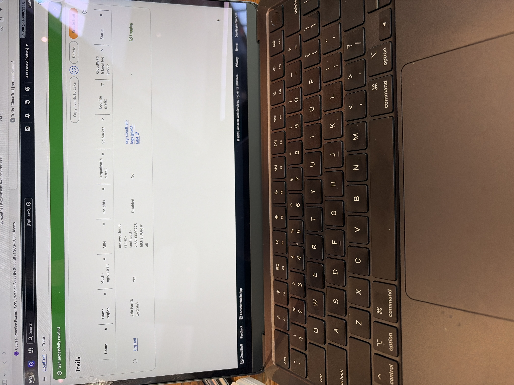
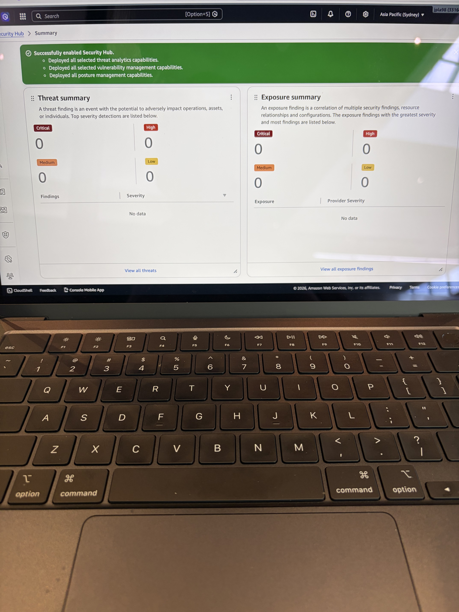

# AWS Cloud Security Governance Lab
> Buiilt a centralized AWS security governance and logging architecture using AWS Organizations, CloudTrail, Amazon S3, and Security Hub.

## Overview
This lab demonstrates centralized security governance, logging, and monitoring in AWS. The goal was to simulate an enterprise cloud security environment.

## Architecture
- AWS Organizations (SCP enabled)
- Amazon S3 for centralized log storage
- AWS CloudTrail for API logging
- AWS Security Hub for monitoring

## Security Controls
- Enabled Service Control Policies (SCPs)
- Secured S3 bucket (Block Public Access ON)
- Configured CloudTrail multi-region logging
- Enabled Security Hub

## Screenshots

### AWS Organizations - SCP Enabled

### S3 Bucket

### CloudTrail Logging

### Security Hub

## Notes
Multi-account setup was simulated due to account creation issues. Core governance and monitoring concepts were still implemented.

## What This Demonstrates
- AWS security governance
- Centralized logging
- Secure cloud architecture
- Monitoring and detection
